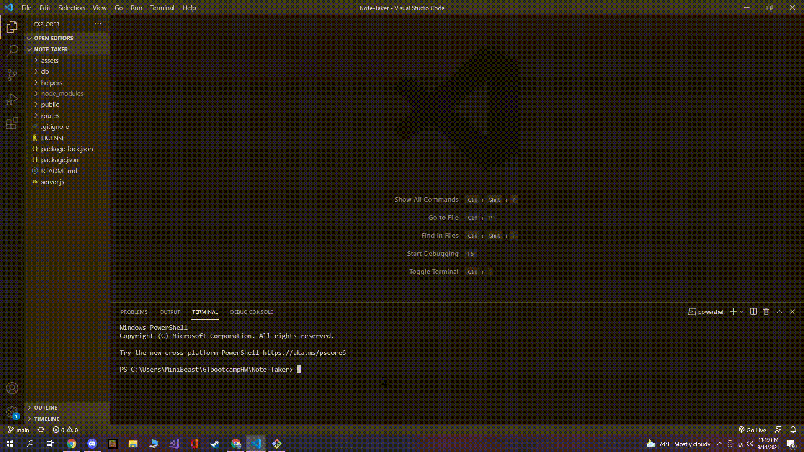
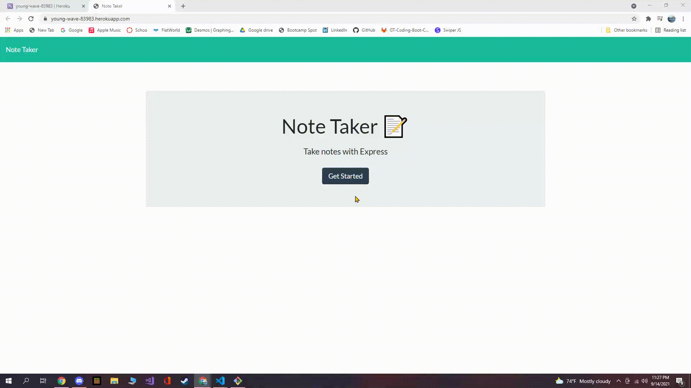

# Note-Taker

## Description

An application that can be used to write and save notes. This application will use an Express.js back
end and will save and retrieve note data from a JSON file.

## Table of Contents

- [installation](#installation)

- [Usage](#usage)

- [License](#license)

- [Contributing](#contributing)

- [Tests](#tests)

- [Images](#images)

- [Application Usage](#applicationusage)

- [Questions](#questions)

## Installation

To install necessary dependencies, run the following command:

---

    npm i

---

## Usage

Use Node.js command line interface to run application

Please refer to this demo gif:

As seen above when you are in your terminal, first download npm dependencies(refer to installation) and start the server by typing in the command line, npm start or node server.js.

## License

This project is licensed under the MIT license

## Contributing

Best way to contribute is by contacting me or posting issues

## Tests

Run the following command to run tests:

---

    n/a

---

## Images

## Application Usage

Application URL: https://young-wave-83983.herokuapp.com/

## Questions

If you have any questions about the repo, open an issue or contact me directly at oscar.a.vizcaino@icloud.com. You can find more of my work at
[oscarV42](https://github.com/oscarV42/).
